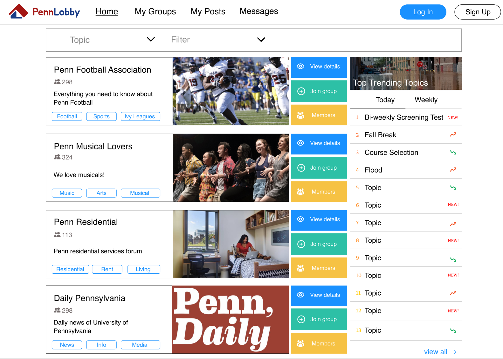
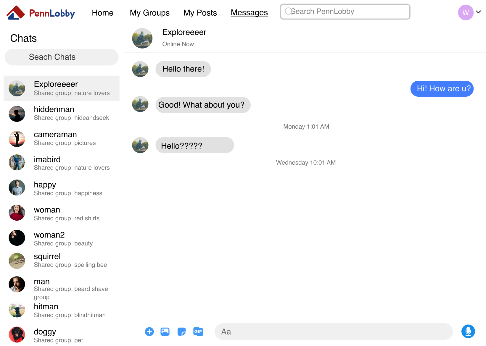

# PennLobby

## Description

 

PennLobby is a group-based social network website, allowing students to participate in groups, create posts, and engage in live chat.

## Tech Stack

- Frontend: React, MUI
- Backend: Node, Express, MongoDB
- Cloud Storage: AWS S3
- Continuous Integration: Travis CI
- Testing: Jest, Cypress
- Deployment: Heroku 
- Live-update: WebSocket APIs

## Main Features

 

1. Account Registration & Login: Users can create an account with a unique username and password, and log in to the app securely. They can also reset their password and deactivate their account if needed.

2. Groups: Once logged in, users can join groups that interest them or create their own groups. They can request to join private groups and be approved or rejected by the group admin. Group admins can also promote or demote other users to be group admins. Users can leave groups at any time, and can sort and suggest groups to others.

3. Posts: Within each group, users can create and read posts, which can be filtered or hidden by users or flagged for deletion by group admins.

4. Comments: Users can comment on posts and reply to other comments within each group.

5. Topics: Groups can be tagged with topics, and trending topics are displayed on the home page.

6. User Profile: Each user has their own profile page where they can display their intro and profile image, and manage their account settings.

7. Group & Post Analytics: Basic stats such as group members, post count, and last active time are displayed for each group and post.

8. Messaging: Users can message other users within the same group.

9. Notifications: Users are notified when their request to join a group is granted or rejected.

## Development Guideline

1. Run `git clone git@github.com:ruichen199801/pennlobby.git`.
2. Run `npm install` in both `client` and `api` directories after cloning the project.
3. Run `npm start` in the `client` directory and open `localhost:3000` in your browser to see the frontend.
4. Run `npm start` in the `api` directory and open `localhost:8080` in your browser to see the backend.
5. Resolve ESLint errors during development for both frontend and backend. Make sure to pass TravisCI check when committing changes and merging into branches.

## Links

1. [Prototype](https://www.figma.com/file/OwPdD7ktVVHmrePxbeeZmr/Wireframe)
2. [SwaggerHub APIs](https://app.swaggerhub.com/organizations/cis557-penn-lobby)
3. [DB Schema](https://dbdiagram.io/d/61a696dc8c901501c0da3224)
4. [Postman Tests](https://www.getpostman.com/collections/01972e50040b6314e5b4)
